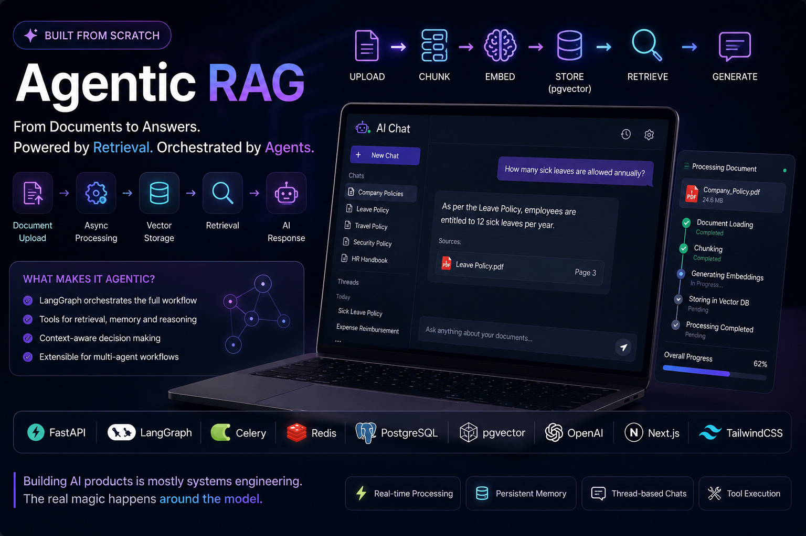

# Agentic RAG Platform

<p align="center">
  
</p>

<p align="center">
  <strong>Production-Style Agentic RAG Platform built with FastAPI, LangGraph, Celery, Redis, PostgreSQL and Next.js</strong>
</p>

<p align="center">
AI Chat • Long-Term Memory • Corrective RAG (CRAG) • Hybrid Retrieval • Query Rewriting • Knowledge Strip Refinement • Real-Time Streaming
</p>

---

## Overview

A production-style AI platform built from scratch to understand how modern AI systems work beyond simple LLM wrappers.

This project combines:

- Conversational AI
- Agentic Workflows
- Long-Term Memory
- Thread Memory
- Corrective RAG (CRAG)
- Hybrid Retrieval
- Query Rewriting
- Knowledge Strip Refinement
- Document Intelligence
- Background Processing
- LangSmith Observability
- Real-Time Streaming
  
Users can upload documents, track ingestion progress in real time, and ask questions grounded in their data.

The system automatically:

1. Stores long-term user memories across conversations
2. Uploads and processes documents asynchronously
3. Chunks and embeds documents
4. Stores embeddings in PostgreSQL using pgvector
5. Retrieves the Top-K candidate chunks
6. Evaluates each retrieved chunk using an LLM
7. Performs Knowledge Strip Refinement
8. Rewrites ambiguous queries when needed
9. Falls back to web search if retrieval confidence is low
10. Generates grounded responses using refined context

---

## Tech Stack

### Backend

- FastAPI
- LangGraph
- OpenAI
- PostgreSQL
- pgvector
- SQLAlchemy
- Alembic
- Celery
- Redis
- JWT Authentication
- Server-Sent Events (SSE)
- OpenRouter
- GPT-5
- Gemini
- LangGraph
- PGVector
- Tavily Search
- Corrective RAG (CRAG)
- Query Rewriting
- Knowledge Strip Refinement
- LangSmith

### Frontend

- Next.js 15
- React
- TypeScript
- TailwindCSS
- ShadCN UI
- React Query
- React Markdown

### AI & Retrieval

- OpenAI GPT Models
- OpenAI Embeddings
- LangGraph
- Vector Similarity Search
- Retrieval-Augmented Generation (RAG)

---

## Architecture

```text
                    ┌────────────────────┐
                    │      Next.js       │
                    │      Frontend      │
                    └─────────┬──────────┘
                              │
                              ▼
                    ┌────────────────────┐
                    │      FastAPI       │
                    │    API Gateway     │
                    └─────────┬──────────┘
                              │
           ┌──────────────────┼──────────────────┐
           ▼                  ▼                  ▼

    ┌────────────┐    ┌──────────────┐    ┌────────────┐
    │ LangGraph  │    │ PostgreSQL   │    │   Celery   │
    │   Memory   │    │  Chat Data   │    │  Workers   │
    └─────┬──────┘    └──────────────┘    └─────┬──────┘
          │                                     │
          ▼                                     ▼
    ┌────────────┐                       ┌────────────┐
    │Checkpoint  │                       │   Redis    │
    │ Persistence│                       │   Queue    │
    └────────────┘                       └────────────┘

                            User Query
                                │
                                ▼
                       LangGraph Agent
                                │
               ┌────────────────┴─────────────────┐
               ▼                                  ▼
        Thread Memory                     Long-Term Memory
       (Checkpointer)                  (LangGraph Store)
               │                                  │
               └────────────────┬─────────────────┘
                                ▼
                        Corrective RAG
                                │
                                ▼
                    Retrieve Top-K Chunks
                                │
                                ▼
                   LLM Document Evaluation
                                │
          ┌─────────────────────┼────────────────────┐
          ▼                     ▼                    ▼

     High Score          Medium Score          Low Score

          │                     │                    │
          ▼                     ▼                    ▼

 Knowledge Strip        Rewrite Query       Rewrite Query
 Refinement                   │                    │
          │                   ▼                    ▼
          │             Tavily Search        Tavily Search
          │                   │                    │
          └──────────────┬────┴────────────────────┘
                         ▼
              Knowledge Strip Refinement
                         ▼
                 Final Grounded Response
```

---

## Features

### Authentication

- User Registration
- Login
- JWT Authentication
- Protected Routes
- Current User Dependency

### Memory

#### Thread Memory

- LangGraph Checkpointer
- Conversation Context
- Stateful Conversations

#### Long-Term Memory

- LangGraph Store
- PostgreSQL
- Cross-thread Memory
- Automatic Memory Extraction
- Personalized Responses
  
### AI Chat

- ChatGPT-style Conversations
- Thread Management
- Conversation Persistence
- Context-Aware Responses
- LangGraph Memory
- Streaming Responses
- Tool Calling

### Corrective RAG (CRAG)

- PDF Uploads
- Semantic Search
- Top-K Retrieval
- LLM-based Document Evaluation
- Query Rewriting
- Hybrid Retrieval
- Tavily Web Search
- Knowledge Strip Refinement
- Context Refinement
- Grounded Generation

### Background Processing

- Celery Workers
- Redis Queues
- Retry Mechanisms
- Progress Tracking
- Failure Recovery
- Status Monitoring

### Real-Time Streaming

- SSE Streaming
- Token-by-Token Responses
- Markdown Streaming
- Tool Execution Events
- Live Progress Updates

---

## RAG Pipeline

```text
User Query
      │
      ▼

Vector Search

      │
      ▼

Retrieve Top-K Chunks

      │
      ▼

LLM Document Evaluation

      │
      ├──────────────┬──────────────┐
      ▼              ▼              ▼

High           Medium          Low

      │              │              │

      ▼              ▼              ▼

Knowledge     Rewrite Query   Rewrite Query
Refinement          │              │
                    ▼              ▼

              Tavily Search   Tavily Search
                    │
                    ▼

       Merge Local + Web Context

                    │
                    ▼

      Knowledge Strip Refinement

                    │
                    ▼

           Grounded Response

```

---

## Database Schema

```text
users
│
├── threads
│    │
│    └── messages
│
└── documents
     │
     └── document_chunks
```

### Users

```text
id
name
username
email
password
created_at
```

### Threads

```text
thread_id
title
user_id
created_at
updated_at
```

### Messages

```text
message_id
thread_id
role
content
status
created_at
updated_at
```

### Documents

```text
document_id
user_id
document_name
document_url
document_stage
document_completion_rate
created_at
updated_at
```

### Document Chunks

```text
chunk_id
document_id
content
embedding
created_at
updated_at
```

---

## Current Capabilities

✅ JWT Authentication

✅ Thread Management

✅ Thread Memory

✅ Long-Term Memory

✅ LangGraph Store

✅ Checkpoint Memory

✅ Corrective RAG (CRAG)

✅ Query Rewriting

✅ Hybrid Retrieval

✅ Knowledge Strip Refinement

✅ Tavily Web Search

✅ Parallel Document Evaluation

✅ PDF Uploads

✅ Vector Search

✅ Tool Calling

✅ SSE Streaming

✅ LangSmith Tracing

✅ Celery Workers

✅ Redis Queue

✅ Document Preview

---

## Engineering Challenges Solved

### Long-Term Memory

Implemented persistent cross-thread memory using LangGraph Store.

Every user message passes through a dedicated memory extraction pipeline.

The memory agent decides:

- Should this be remembered?
- Is it new?
- Does it already exist?
- Should it be stored?

Only important user information is persisted.


### Corrective RAG (CRAG)

Instead of trusting retrieved chunks blindly, every retrieved document is first evaluated by an LLM.

Depending on the confidence score, the pipeline:

- Uses local documents directly
- Rewrites ambiguous queries
- Searches the web
- Performs Knowledge Strip Refinement
- Generates a grounded response

This significantly reduces hallucinations while improving retrieval quality.


### SSE Markdown Corruption

While implementing streaming markdown responses, markdown tables appeared broken even though the model output was correct.

The issue:

```python
yield f"data: {token}\n\n"
```

Newline characters inside tokens were interpreted by SSE as message boundaries.

The solution:

```python
yield f"data: {json.dumps(token)}\n\n"
```

Frontend:

```typescript
const token = JSON.parse(data);
```

This preserved:

- Tables
- Lists
- Headings
- Code Blocks
- Markdown Formatting

---

## Getting Started

### Backend

```bash
cd chatbot-backend

uv venv
source .venv/bin/activate

uv sync

alembic upgrade head

uvicorn app.main:app --reload
```

### Start Redis

```bash
docker run -d \
  --name redis \
  -p 6379:6379 \
  redis:latest
```

### Start Celery Worker

```bash
celery -A app.worker.celery_app worker --loglevel=info
```

---

### Frontend

```bash
cd chatbot-frontend

npm install

npm run dev
```

---

## Roadmap

### Completed

- JWT Authentication
- Thread Management
- Thread Memory
- Long-Term Memory
- LangGraph Store
- Corrective RAG
- Query Rewriting
- Knowledge Strip Refinement
- Hybrid Retrieval
- LangSmith Tracing
- SSE Streaming
- Tool Calling
- Celery Processing
- Redis Queues
- Agentic RAG

### Next

- Conversation Summarization
- Context Trimming
- Semantic Memory Retrieval
- Hybrid Search (BM25 + Vector)
- SQL Agent
- Multi-Agent Systems
- Human-in-the-Loop
- Deep Research Agent
- MCP Integration
- Docker Deployment
- Kubernetes

---

## Author

**Priyansh Gupta**

Software Engineer → AI Engineer

Building AI Systems in Public

- GitHub: https://github.com/PriyanshGupta2002
- LinkedIn: https://linkedin.com/in/priyansh-gupta

---

## License

MIT