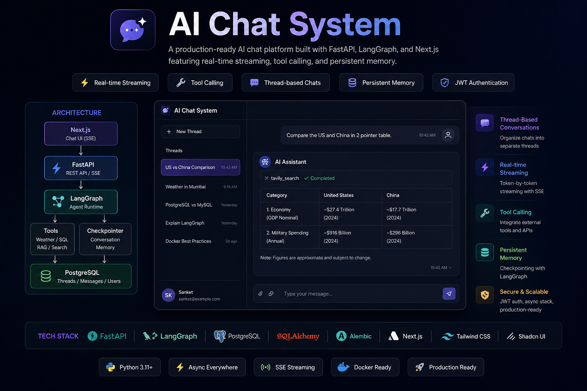

# LangGraph Chatbot

<p align="center">
  
</p>

<p align="center">
  <strong>Production-style AI Chat Application built with FastAPI, LangGraph, PostgreSQL and Next.js</strong>
</p>

<p align="center">
  ChatGPT-style Threads • Persistent Memory • Tool Calling • SSE Streaming • Real-Time UI
</p>

---

## Overview

A full-stack AI chatbot built from scratch to understand how production conversational AI systems work under the hood.

Unlike simple LLM wrappers, this project includes:

- Thread-based conversations
- Persistent chat history
- LangGraph memory via checkpoints
- Real-time token streaming
- Tool execution tracking
- JWT authentication
- PostgreSQL persistence
- Modern Next.js chat interface

---

## Tech Stack

### Backend

- FastAPI
- LangGraph
- OpenAI
- PostgreSQL
- Async SQLAlchemy
- Alembic
- JWT Authentication
- Server-Sent Events (SSE)

### Frontend

- Next.js 15
- React
- TypeScript
- TailwindCSS
- React Markdown
- Streaming UI

---

## Architecture

```text
                    ┌─────────────────┐
                    │     Next.js     │
                    │  Streaming UI   │
                    └────────┬────────┘
                             │
                             │ SSE
                             ▼
                    ┌─────────────────┐
                    │     FastAPI     │
                    │  Chat Backend   │
                    └────────┬────────┘
                             │
          ┌──────────────────┼──────────────────┐
          ▼                  ▼                  ▼

 ┌──────────────┐  ┌────────────────┐  ┌──────────────┐
 │ JWT Auth     │  │ LangGraph      │  │ PostgreSQL   │
 │ Middleware   │  │ StateGraph     │  │ Threads      │
 └──────────────┘  └───────┬────────┘  │ Messages     │
                            │           └──────────────┘
                            ▼
                  ┌──────────────────┐
                  │ Tool Execution   │
                  │ Weather / Future │
                  │ RAG / SQL Tools  │
                  └─────────┬─────────┘
                            │
                            ▼
                  ┌──────────────────┐
                  │ Checkpointer     │
                  │ Conversation Mem │
                  └──────────────────┘
````

---

## Features

### Authentication

* User Registration
* Login
* JWT Authentication
* Protected Routes
* Current User Dependency

### Chat Threads

* ChatGPT-style Thread Management
* Create Conversations
* Fetch Conversation History
* Thread-Based Context Retention

### Messages

* USER Messages
* ASSISTANT Messages
* TOOL Messages
* SYSTEM Messages

### LangGraph

* StateGraph Integration
* Checkpoint-Based Memory
* Thread-Aware Context
* OpenAI Integration
* Tool Calling Support

### Real-Time Streaming

* Server-Sent Events (SSE)
* Token-by-Token Streaming
* Optimistic UI Updates
* Markdown Rendering During Streaming
* Tool Execution Events

### Tool Execution Tracking

```text
🔍 Querying Database...
✓ SQL Query Executed

Assistant: You have 42 messages.
```

Supported event types:

```text
tool_start
tool_end
done
```

---

## Database Schema

```text
users
│
└── threads
     │
     └── messages
```

### Users

```text
id
name
email
password
created_at
```

### Threads

```text
thread_id (UUID)
title
user_id
created_at
updated_at
```

### Messages

```text
message_id (UUID)
thread_id
content
role
status
created_at
updated_at
```

### Enums

#### MessageRole

```text
USER
ASSISTANT
SYSTEM
TOOL
```

#### MessageStatus

```text
PENDING
COMPLETED
FAILED
```

---

## Conversation Memory

Each thread acts as an independent conversation.

```text
Thread ID
      │
      ▼
LangGraph Checkpointer
      │
      ▼
Previous Messages
      │
      ▼
Context-Aware Response
```

This allows conversations to continue naturally without manually sending the full history from the frontend.

---

## Streaming Flow

```text
User Message
      │
      ▼
POST /chat/stream
      │
      ▼
LangGraph astream_events()
      │
      ▼
Tool Events
      │
      ▼
Token Streaming
      │
      ▼
SSE Response
      │
      ▼
Live UI Updates
```

---

## Engineering Challenges Solved

### SSE Markdown Corruption

One of the most interesting bugs encountered during development involved markdown tables rendering incorrectly while streaming.

The issue was caused by streaming raw tokens directly through SSE:

```python
yield f"data: {token}\n\n"
```

Newline characters inside tokens were interpreted by the SSE protocol as message boundaries.

The solution:

```python
yield f"data: {json.dumps(token)}\n\n"
```

And decoding on the frontend:

```typescript
const token = JSON.parse(data)
```

This preserved markdown formatting during streaming and enabled proper rendering of:

* Tables
* Lists
* Code Blocks
* Headings

---

## Getting Started

### Backend

```bash
cd chatbot-backend

uv venv
source .venv/bin/activate

uv pip install -r requirements.txt

alembic upgrade head

uvicorn app.main:app --reload
```

---

### Frontend

```bash
cd chatbot-frontend

npm install

npm run dev
```

---

## API Endpoints

| Method | Endpoint                | Description     |
| ------ | ----------------------- | --------------- |
| POST   | `/auth/register`        | Register User   |
| POST   | `/auth/login`           | Login User      |
| GET    | `/auth/me`              | Current User    |
| POST   | `/threads`              | Create Thread   |
| GET    | `/threads`              | List Threads    |
| GET    | `/threads/{id}`         | Get Thread      |
| GET    | `/messages/{thread_id}` | Thread Messages |
| POST   | `/chat/stream`          | Streaming Chat  |

---

## Current Roadmap

### ✅ Completed

* JWT Authentication
* Thread Management
* Message Persistence
* LangGraph Integration
* Checkpoint Memory
* SSE Streaming
* Markdown Rendering
* Tool Events
* Next.js Frontend

### 🚧 In Progress

* Document Uploads
* RAG Pipeline
* Retriever Tool
* Vector Database Integration

### 🔮 Planned

* SQL Agent
* Multi-Agent Workflows
* Celery + Redis
* Background Processing
* Docker Deployment

---

## Author

**Priyansh Gupta**

Software Engineer → AI Engineer

* GitHub: https://github.com/PriyanshGupta2002
* LinkedIn: https://linkedin.com/in/priyansh-gupta

---

## License

MIT
